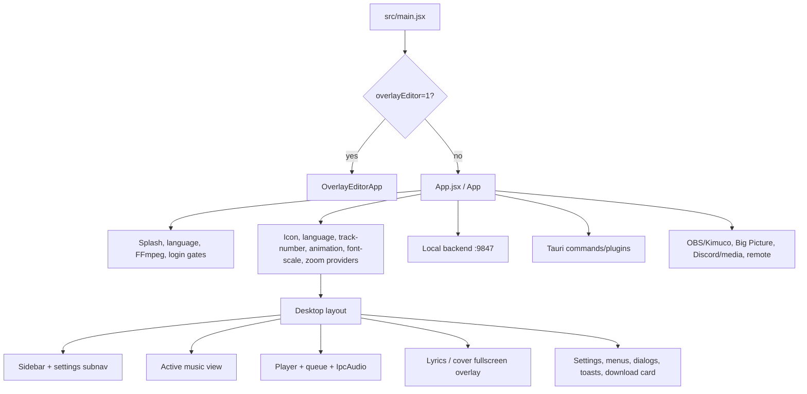

# `src/App.jsx` structure inventory

## Scope and snapshot

This is a read-only architecture inventory. It was first recorded at Step 1
(20,801 lines) as a baseline before any extraction; the numbers below are a
**re-measurement after Steps 2–11** of `cleanup.app.jsx.md` (see that file's
progress checklist for authoritative, per-step status). Steps 2–10 moved the
in-file views, settings panel, lyrics engine, and player/queue UI out into
`features/`; Step 11 finished the player controller/context split. What remains
in `App.jsx` today is close to the target "thin composition root plus startup
gates, providers, and app-shell effects/state" described in
`cleanup.app.jsx.md`, though Steps 12–14 (remaining domain controllers,
`app/AppShell.jsx` + `app/AppOverlays.jsx`, and the deferred `views/`/`modals/`/
`ui/`/`lyrics/`/`unison/`/`overlay/`/`bigpicture/` bucket migrations) have not
started — `App.jsx` is intentionally still the composition root and still owns
app-shell state/effects (navigation, selection/menus, downloads, updates/news,
appearance, playback-adjacent app-shell concerns, profiles/auth, and the
fullscreen/lyrics overlay layer) until those steps land.

- File size: **5,761 lines** (was 20,801 at the Step 1 baseline).
- `App()` span: starts at **line 2,576** (function-level component; the file is
  now overwhelmingly the `App()` function plus its module-level imports/setup —
  it no longer contains the large embedded feature components the Step 1
  baseline described).
- Root state: **106 `useState` cells** (module-wide count; almost all belong to
  `App()` now that feature views/settings/lyrics/player-UI are extracted).
- Root effects: **30 `useEffect` calls**.
- Root persistence calls: **92 `localStorage` reads/writes/removals**.
- Root outbound call sites: **16 `fetch()` calls**.
- The Step 1 styling/JSX-bulk counts (597 inline `style` props, 561 `className`
  uses, four inline `<style>` tags) predate the view/settings/player extractions
  and are no longer representative; re-measure before relying on them.

These counts are intentionally a snapshot: this is an actively changing file, so
line numbers and totals will drift. The ownership and coupling observations are the
important part. The rest of this document (file map, effect/state inventories,
persistence/integration lists) is the original Step 1 baseline and describes code
that has since moved into `features/*` per `cleanup.app.jsx.md` — read it as
historical evidence for *why* each domain was extracted, not as the current file
layout.

## What this module currently is

`App.jsx` is not only the root React component. It also contains:

- process/window/audio adapters and module-level configuration;
- desktop chrome, sidebar, context menus, and selection UI;
- the entire settings surface and several settings sub-features;
- player, queue, visualizer, fullscreen cover, and audio-facing logic;
- lyrics rendering, lyric cache/import/translation/romaji logic;
- browse, search, library, collection, history, liked, and artist views;
- login/language/FFmpeg startup screens;
- profile, download, remote, OBS, Last.fm, update, news, and diagnostics orchestration.

The result is a module-level dependency hub and a root component that coordinates
unrelated domain state. The corresponding cleanup plan is in
[`cleanup.app.jsx.md`](./cleanup.app.jsx.md).

## File map

| Lines | Current responsibility | Notable contents | Natural eventual owner |
| --- | --- | --- | --- |
| 1–767 | Module bootstrap and shared configuration | imports, Tauri window setup, API/version/news constants, shortcut helpers, debug-console interception, keyframes | `app/`, `shared/lib/`, `shared/api/`, `shared/i18n/` |
| 768–986 | Audio adapter | `IpcAudio`, a Rust-audio-backed `HTMLAudioElement`-like adapter with native `Audio` fallback | `features/player/` |
| 987–2,041 | Desktop chrome and navigation | `TitleBar`, context-menu primitives, `Sidebar` | `app/` + `shared/ui/` + `features/profiles/` |
| 2,042–5,441 | Settings support components/helpers | accent/color helpers, storage/cache, Last.fm, debug, Unison identity, overlay geometry, settings sidebar/account tab | mostly `features/settings/`; community lyrics under `features/lyrics/community/` |
| 5,442–8,356 | Settings implementation | `SettingsPanel` and all settings-tab JSX | `features/settings/` |
| 8,357–11,209 | Playback presentation | `QueueRow`, `QueuePanel`, `Player`, cover/visualizer helpers | `features/player/` |
| 11,210–12,572 | Lyrics presentation and behavior | exported `LyricsOverlay`, word timing/painting helpers | `features/lyrics/` |
| 12,573–15,021 | Music browsing UI | library, search, home, artist, collection support components | `features/music/` |
| 15,022–16,125 | Startup/system screens | login, language picker, FFmpeg setup/update banner, splash, ambient backdrop | `features/profiles/`, `app/`, `features/overlay/` as applicable |
| 16,126–20,801 | `App()` root | application state, effects, commands, provider tree, layout, dialogs, menus | thin `app/App.jsx` + `app/AppShell.jsx` after extraction |

### Important public/internal boundaries today

- `main.jsx` mounts this module as the normal desktop application.
- `OverlayEditorApp.jsx` is selected separately by the `?overlayEditor=1` query
  parameter; it also uses `overlay/` code.
- `LyricsOverlay` is a named export from `App.jsx`. `bigpicture/Lyrics.jsx` imports it
  directly. This is the only known feature-to-`App` dependency and must be changed in
  the same commit as the lyrics extraction.
- `IpcAudio` is created once per App instance in a ref and is passed to the player and
  lyrics. It is a behavior-critical boundary, not a generic UI helper.

## Runtime flow

### Startup and gate behavior

`App` does not return a sequence of exclusive screen components. It renders a layered
application and conditionally places startup UI over it.

1. It initializes splash state and checks whether FFmpeg was previously confirmed.
2. It schedules a deferred FFmpeg update check after the startup path is available.
3. It mounts the provider stack and global style/keyframe injection.
4. It displays the language picker first for a first-run user, then the FFmpeg setup
   screen if required, while the splash animates independently.
5. It restores cached profile information, retries backend auth validation, and shows
   login if no usable profile is available.
6. Normal desktop layout remains composed of sidebar, active view, player, queue,
   overlay, settings, and top-level transient UI.

## Root state inventory

The state below belongs specifically to `App()`. Each embedded component above it has
additional local state that is not included in the 127-cell count.

| Domain | Root state | Meaning / current owner |
| --- | --- | --- |
| Startup | `showSplash`, `splashFading`, `ffmpegSetupDone`, `ffmpegUpdate` | splash timing and FFmpeg availability/update prompt |
| Navigation and layout | `view`, `navHistory`, `appKey`, `viewRefreshKey`, `sidebarCollapsed`, `sidebarWidth`, `sidebarResizing`, `queueWidth`, `queueResizing` | route-like view selection, hard refresh keys, responsive desktop shell geometry |
| Selection and menus | `globalContextMenu`, `trackContextMenu`, `selectedTracks`, `selectionPlaylistOpen`, `addToPlaylistFor`, `createPlaylistOpen`, `createPlaylistForSelection`, `createPlaylistTracks`, `renameDialog`, `deleteDialog` | transient selection/menu/modal state spanning several music views |
| Music/library status | `pinnedIds`, `collection`, `artistView`, `searchQuery`, `cachedSongIds`, `likedIds`, `premiumSongIds` | profile-scoped pins/recents and currently-open music content/status |
| Download/offline | `downloadingIds`, `downloadQueue`, `downloadBatches`, `pendingDownloadQueue`, `downloadQueueMin`, `offlineMode`, `isActuallyOffline` | active download orchestration, batch presentation, and offline fallback |
| App update/news/feedback | `updateInfo`, `updateDownloading`, `updateDownloadProgress`, `updateDownloaded`, `newsItems`, `newsSeenIds`, `newsOpen`, `newsUnreadSnapshot`, `feedbackOpen`, `feedbackShot`, `debugFloat` | update lifecycle, news read state, screenshot-backed bug report, debug window |
| Settings shell | `settingsOpen`, `settingsClosing`, `settingsTab`, `settingsInitialTab` | settings overlay and sidebar sub-navigation coordination |
| Appearance | `accent`, `accentDynamic`, `accentSat`, `accentLight`, `theme`, `highContrast`, `appFont`, `appFontScale`, `uiZoom`, `animations`, `ambientBackground`, `flashbang` | document CSS variables/attributes plus visual preferences |
| Visualizer/lyrics preferences | `ambientVisualizer`, `instrumentalViz`, `vizConfig`, `lyricsFontSize`, `lyricsTranslationFontSize`, `lyricsRomajiFontSize`, `showLyricsTranslation`, `lyricsTranslationLang`, `showRomaji`, `syllableZoom`, `fluidLyrics`, `showAgentTags`, `lyricsProviders` | lyrics/visualizer presentation and provider choices |
| Playback core | `currentTrack`, `isPlaying`, `queue`, `queueOpen`, `queueSettled`, `fullscreen`, `playerVisible`, `cursorVisible`, `crossfade`, `crossfadeOverrides`, `playbackProgressive`, `autoplay` | queue and playback state, fullscreen presentation, and player settings consumed by Player/Queue/Lyrics/Big Picture |
| Lyrics session | `overlayOpen`, `lyricsRefetchKey`, `forcedLyricsProvider`, `currentLyricsSource`, `failedLyricsProviders`, `isCustomLyrics`, `showLyrics`, `splitView`, `splitRatio`, `splitResizing` | current-track lyrics session, fullscreen cover/lyrics/split state |
| Platform integrations | `discordRpc`, `closeTray`, `obsEnabled`, `obsPort`, `obsPortInput`, `ipv4First`, `remoteEnabled`, `remoteInfo`, `remoteDevices`, `remoteTrusted`, `pairModalOpen`, `appIcon` | native platform and network integration settings/status |
| Language/accessibility/shortcuts | `language`, `hideExplicit`, `showTrackNumbers`, `anonStats`, `hideUserHandle`, `customShortcuts`, `shortcutLabels`, `recordingShortcut` | global UI behavior and keyboard mappings |
| Profiles/auth | `profiles`, `hasProfile`, `showLogin`, `showLangPicker`, `showProfileSwitcher`, `addingProfile`, `reauthName`, `currentProfile` | profile list, cached/startup auth, login and account-switching flow |

### Important non-state ownership in `App`

| Reference / mutable value | Why it exists | Risk when moving |
| --- | --- | --- |
| `audioRef` | One `IpcAudio` instance for the lifetime of the app | Must remain singleton-like; changing lifecycle can duplicate audio, listeners, or native commands. |
| `queueRef` | Latest queue for keyboard and callback paths without stale closures | Keep synchronized with the queue owner. |
| `showLyricsRef`, `splitViewRef`, `instrumentalVizRef`, `autoCoverRef`, `lastInstSwitchRef` | Protect manual lyrics/cover choices from automatic instrumental switching | Preserve timing/cooldown behavior when extracting fullscreen lyrics. |
| `updateDownloadAbortRef`, `mutePrevVolumeRef`, `hideTimerRef` | transient update/volume/fullscreen behavior | Their cleanup behavior belongs with their owning feature. |
| Last.fm refs | connection and scrobble accumulation state | Scrobble threshold and start timestamp must remain continuous across renders. |
| profile/session refs | profile cache, session-warning suppression, hidden session keeper lifecycle | Keep profile switching/reset ordering intact. |
| shortcut refs | latest shortcut map and capture target for a global keydown listener | Avoid stale closures and preserve text-input/modal exclusions. |
| `navStateRef` | synchronously fresh navigation snapshot | Navigation extraction must preserve back-stack semantics. |

## `useEffect` inventory

The root has 48 effects. They are grouped below by purpose; the listed line numbers are
the current start lines in `src/App.jsx`.

### Startup, updates, news, and document appearance

| Lines | Effect |
| --- | --- |
| 16,135 | Deferred FFmpeg update check after setup completes and the browser is online. |
| 16,152 | Splash fade/hide timers. |
| 16,364 | Initial app-update check and start of Rust audio-level collection. |
| 16,452 | Loads news, sends the opt-out heartbeat, rechecks news every 15 minutes and on window focus. |
| 16,470 | Opens important unread news once when the feed arrives. |
| 16,619 | Applies the initial `data-theme` document attribute. |
| 16,631 | Derives dynamic accent from the current cover image and applies CSS variables. |
| 16,665 | Counts visible application usage and flushes it to storage. |
| 16,682 | Counts listening time only while playback is active. |

### Last.fm, tray, overlay, and lyrics/fullscreen presentation

| Lines | Effect |
| --- | --- |
| 16,720 | Loads Last.fm connection state and reacts to Last.fm/profile-change events. |
| 16,731 | Resets Last.fm tracking and sends now-playing on track change. |
| 16,747 | Accumulates playback and scrobbles after the configured duration threshold. |
| 16,767 | Applies close-to-tray behavior through Tauri on mount. |
| 16,786 | Pushes the saved/migrated OBS overlay document to the backend on mount. |
| 16,820 | Mirrors `queue` into `queueRef` for stale-closure-safe commands. |
| 16,851 | Clears selected/failed lyrics provider state when the track changes. |
| 16,929 | Installs fullscreen mouse timers that hide the cursor/player controls after inactivity. |
| 16,966 | Pauses playback when the Composer window dispatches `kodama-pause-playback`. |

### Playback, external playback consumers, deep links, and downloads

| Lines | Effect |
| --- | --- |
| 16,979 | Sets the browser/native window title from track and playback state; resets it after a paused timeout. |
| 17,007 | Debounces Discord rich presence and OS media metadata, then refreshes elapsed time every 15 seconds. |
| 17,070 | Posts now-playing state every second to Kimuco and, when enabled, the built-in OBS overlay. |
| 17,162 | Registers `play`/`enqueue` handlers with the Big Picture bridge. |
| 17,202 | Handles cold-start and running `kodama://song/<id>` deep links. |
| 17,224 | Polls the backend download queue while downloads are active; updates cache/premium/batch state. |
| 17,276 | Removes completed download-batch cards after a short delay. |
| 17,291 | Drains the pending download queue up to the five-download concurrency limit. |
| 17,603 | Marks the queue panel settled after its opening transition so blur work is deferred. |

### Preferences, remote control, and profile session maintenance

| Lines | Effect |
| --- | --- |
| 17,667 / 17,670 | Mirrors shortcut state and shortcut-recording target into refs for the global keyboard handler. |
| 17,711 | Applies font-scale CSS variables/derived sizes to the document. |
| 17,739 | Persists/normalizes lyric provider configuration after initialization. |
| 17,764 | Fetches the IPv4-first backend setting. |
| 17,871 | Synchronizes remote-control commands/state with the backend when remote control is enabled. |
| 17,893 / 17,897 | Polls remote status and manages remote/device update behavior. |
| 17,923 | Applies/restores the selected application icon through Tauri. |
| 18,011 | Starts, rotates, and stops the native hidden session-keeper WebView for the active real profile. |
| 18,200 | Sends a 30-second local backend keepalive ping. |
| 18,208 | Loads cached-song identifiers, with retry for slow backend startup. |
| 18,227 | Loads liked-song identifiers. |
| 18,241 | Starts the OBS overlay server on mount when it was previously enabled. |

### Connectivity, authentication, system labels, and global input

| Lines | Effect |
| --- | --- |
| 18,310 | Listens for browser online/offline events, refreshes profile state, and forces view refresh on reconnect. |
| 18,327 | Opens the floating debug window in response to the custom debug event. |
| 18,344 | Bootstraps auth: loads cached profile, retries `/auth/validate`, falls back to background polling, and controls login visibility. |
| 18,433 | Sets initial localized tray labels via Tauri. |
| 18,444 | Adds a non-passive global wheel listener for player-volume adjustment. |
| 18,520 | Clears selected tracks whenever the active view changes. |
| 18,525 | Installs the capture-phase global keyboard shortcut handler, including fullscreen, transport, seek, volume, lyrics, shortcut recording, and zoom. |

The effect count includes several short remote/profile/style synchronization effects whose
exact responsibility overlaps their neighboring callback code. They should be migrated
as coherent feature blocks, not mechanically one effect at a time.

## Commands and business operations held by `App`

`App` contains the command layer as well as the UI. The notable command groups are:

| Domain | Commands / behavior |
| --- | --- |
| Navigation | `navigateTo`, `goBack`, `openArtist`, `openPlaylist`, `openAlbum`, `handleSearch`, `addRecentPlaylist`, `removeRecentPlaylist`; manages history snapshots and collection streaming. |
| Playback | `handlePlay`, `enqueue`, `startSongRadio`, deep-link `playByVideoId`; resets lyric session state and records profile-scoped play history. |
| Downloads | single/batch enqueue, active queue polling, batch cancellation, cache removal, export via save dialog and status polling. |
| Music metadata/actions | like/unlike with optimistic state and Last.fm mirroring, pin/unpin, playlist create/add/remove/delete/rename actions, track/share/lyrics context-menu actions. |
| Settings | theme/accent/font/zoom/visualizer/lyrics/provider/shortcut/crossfade/remote/OBS application and persistence. |
| Profiles | fetch/cache/auth bootstrap, switch/add/reauth/remove/rename/avatar/logout, session-keeper lifecycle, profile-change reset behavior. |
| System integration | updater check/download/install, FFmpeg update prompt, tray labels, close-to-tray, app icon, fullscreen, screen capture, feedback, news, remote pairing. |

### State reset sequences worth preserving

Profile switching, profile removal, and logout each reset some combination of:

- active view to `home`;
- current track and queue;
- collection, lyrics overlay, and queue panel;
- search query and view refresh key;
- `window.__activeProfile` and a `profile-switched` custom event;
- profile/login state.

These sequences are business rules. They must become a single profile-domain action
before they are deduplicated; changing their order could leak a prior profile's UI or
playback state.

## Rendering and prop flow

### Provider stack

The returned tree nests, in order:

1. `IconContext.Provider` with bold icon weight.
2. `LangContext.Provider` with the current language code.
3. `TrackNumberContext.Provider` with the track-number preference.
4. `AnimationContext.Provider` with the animation preference.
5. `FontScaleContext.Provider` with app font scale.
6. `ZoomContext.Provider` with UI zoom.

This is a presentation-focused provider stack. It does not contain the large domain
state held by App, which is why values are still carried through long prop chains.

### Rendered desktop layers

1. Injected global keyframes and optional animation-disabling override.
2. Startup gates: splash, language picker, FFmpeg setup/update banner.
3. Toast provider and temporary flash overlay.
4. Ambient backdrop and platform-specific titlebar.
5. Sidebar, optional settings sub-navigation, and sidebar resize handle.
6. Main content card with a view switch for `home`, `search`, `liked`, `history`,
   `library`, `collection`, `artist`, and `downloads`.
7. Selected-track action bar and the floating `Player`.
8. Lyrics/cover fullscreen overlay, including split-pane resize handle.
9. Right-docked `QueuePanel` and queue resize handle.
10. Login, remote pairing, settings panel, debug floating window, and all modal/menu
    overlays.

### Main prop bottlenecks

- `Sidebar` receives navigation, profile, playlist, offline, update, OBS, news, and
  feedback behavior through a long callback list. It is both navigation UI and a
  profile/settings launcher.
- `SettingsPanel` receives appearance, accessibility, lyrics, playback, remote,
  update, profile, overlay, shortcut, and native integration state/actions. Many
  change handlers persist storage or invoke Tauri inline in the JSX call site.
- `Player` receives playback state, queue, audio ref, fullscreen/overlay state, lyrics
  session state, download/cache state, and playlist actions. It is the largest
  presentation-to-orchestration prop boundary.
- View components receive overlapping subsets of playback, music action, selection,
  download, and navigation props.

## Styling model

### Sources of styling

- `src/main.jsx` imports `src/index.css`, which imports Tailwind and HeroUI styles.
- `App.jsx` injects `GLOBAL_KEYFRAMES` in the provider tree. It also injects a global
  animation/transition disable rule when animations are off.
- The module includes four `<style>` tags overall and a tooltip keyframe style injected
  directly into `document.head` at module evaluation time.
- The whole module uses a mixed styling model: **597 inline style props**, **561
  `className` expressions**, CSS custom properties, and a small number of data
  attributes such as `data-theme`, `data-highcontrast`, and `data-ambient`.

### Runtime CSS behavior owned by App

- Theme, high contrast, accent, dynamic accent, and font selection write directly to
  `document.documentElement` CSS variables/attributes.
- UI zoom is applied using the CSS `zoom` property on the app shell and compensates
  shell height with `100 / uiZoom` viewport height.
- Layout geometry (sidebar/queue widths, overlay bounds, fullscreen player visibility)
  is calculated inline and coupled to state.
- Animation preference controls both component transition values and a global style
  override that turns all transitions/animations off.
- Fullscreen and settings states change opacity, transforms, visibility, z-index, and
  pointer events in the root render tree.

### Styling implications for extraction

Move styles with the component that owns the interaction. Do not centralize every
inline style as a first pass: root layout geometry, fullscreen overlay behavior, and
the player visualizer are behavior-sensitive. A safe sequence is to extract the
component unchanged, then replace stable repeated values with component-scoped classes
or CSS custom properties after visual regression checking.

## Persistence

`App()` itself has 137 direct `localStorage` calls. They cover at least these classes:

- global appearance and accessibility preferences;
- UI geometry and fullscreen split ratio;
- playback preferences, crossfade overrides, lyrics choices, and shortcuts;
- profile-scoped history, pins, and recent entities;
- profile cache and offline behavior;
- download/export directory and cache-adjacent settings;
- news read state, anonymous heartbeat state, FFmpeg/update dismissal state;
- remote trust/token and OBS configuration;
- security/PIN state and lyric custom-content/cache state in embedded components.

The storage keys are a compatibility surface. Feature extraction must preserve key,
serializer, default, error fallback, profile scoping, and write timing. The generic
persisted-state hook proposed in the cleanup plan should first handle simple scalar
preferences only; profile keys, secrets/identity, caches, and migrations need explicit
feature-level handling.

## Outgoing integrations

### Local backend (`API`, currently localhost port 9847)

The root App calls the local backend for:

| Area | Representative endpoints / behavior |
| --- | --- |
| Startup/system | FFmpeg update status, app status keepalive, IPv4-first setting, news fallback |
| Profiles/auth | validate, list/switch/delete/rename/avatar profiles, begin add, local account, logout |
| Music navigation | stream playlists through `EventSource`, album fetch, artist open, song metadata, radio |
| Library actions | likes, cached-song IDs/list/removal, pins/recents in local storage, playlist mutations in render-time menu handlers |
| Downloads/export | queue polling, start downloads, batch cache deletion, FFmpeg availability, export start/status polling |
| Lyrics | current source/providership via props plus custom lyrics, fetch/import/export actions in the root menus |
| Remote/overlay | remote enable/status/device requests, overlay config/start/stop/push |
| Integrations | Last.fm status/now-playing/scrobble/love, profile/session maintenance |

Some embedded components in the same file make additional backend calls for their own
features (lyrics translation/romanization, browse/search/home/artist data, FFmpeg
screens, cache/debug/Unison). Moving those components removes calls from this module
without changing backend behavior.

### Tauri/native APIs

`App.jsx` dynamically imports or invokes:

- updater check/download/install and process relaunch;
- native webview/window title, fullscreen, custom window creation, and event listening;
- dialog save/open and filesystem read/write paths;
- deep-link startup and running URL events;
- tray labels, close-to-tray, application icon, screenshot capture, and server stop;
- native audio commands/events through `IpcAudio`;
- OS media metadata and Discord RPC;
- hidden session-keeper WebView start/rotate/stop for authenticated profiles.

Native calls are intentionally lazy-loaded in many paths. Preserve that behavior unless
bundle/startup measurement demonstrates a safe alternative.

### Other network/browser integrations

- Remote GitHub raw news feed and the GitHub releases endpoint.
- Opt-out anonymous heartbeat to the configured Cloudflare Worker.
- Kimuco now-playing bridge at `127.0.0.1:8888`.
- External URLs opened through the Tauri opener (YouTube Music, docs, social links,
  lyric editor, and more).
- Wikipedia fetch/open behavior in the in-file artist-description component.
- Browser `EventSource` for playlist and FFmpeg progress streams.
- Browser custom events such as profile/pin/recent/history/Last.fm/debug changes,
  plus native audio, online/offline, focus, wheel, and keydown listeners.

## High-risk seams to preserve during cleanup

1. **`IpcAudio` contract.** It masquerades as the subset of `HTMLAudioElement` used by
   Player, routes to Rust for OBS capture, and falls back to browser audio. Move it
   with player lifecycle and test both native and fallback paths.
2. **Big Picture bridge.** It currently reaches into App through `LyricsOverlay` and
   registers playback commands against App callbacks. Replace that with explicit
   lyrics/player feature exports before moving the root.
3. **Profile reset ordering.** Profile changes affect playback, navigation, overlays,
   caches, and persisted profile scope.
4. **Fullscreen geometry and pointer events.** Player/queue/lyrics/settings overlap
   through z-index, transforms, opacity, and `pointerEvents`; visual extraction can
   break interaction even when the build passes.
5. **Timed and polling effects.** News, auth retries, download polling, session keeper,
   Kimuco/OBS push, Discord refresh, scrobbling, and fullscreen hiding all own timers
   that must clean up correctly.
6. **Storage compatibility.** A persistence abstraction must not convert booleans,
   JSON, profile keys, or secret-bearing values incorrectly.
7. **Inline action handlers.** Several profile, playlist, OBS, native, and storage
   mutations occur directly in JSX props. Extract them into named feature actions
   before changing behavior.

## Suggested use of this inventory

Use this document as the baseline while executing `cleanup.app.jsx.md`:

- When extracting a feature, move its state, effects, outgoing calls, styles, and
  cleanup together; do not leave only the JSX behind.
- Use the state/effect groupings to decide context boundaries. Settings and player are
  the first broad shared domains; profile and download contexts should be introduced
  only when their consumers no longer fit a focused hook.
- Treat each row in the effect and integration sections as a manual verification cue
  for the related cleanup step.
- Update the snapshot counts and line map after each major extraction so the next
  implementation step operates from current evidence.
